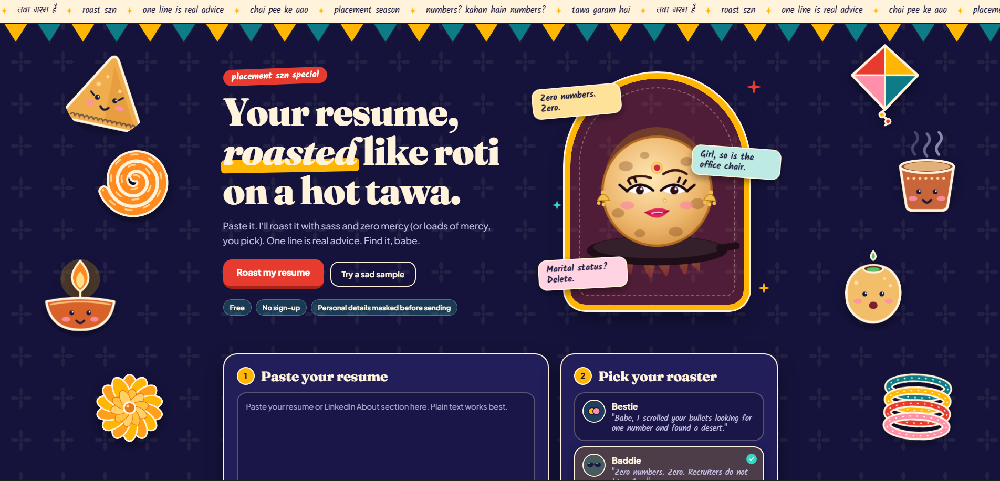
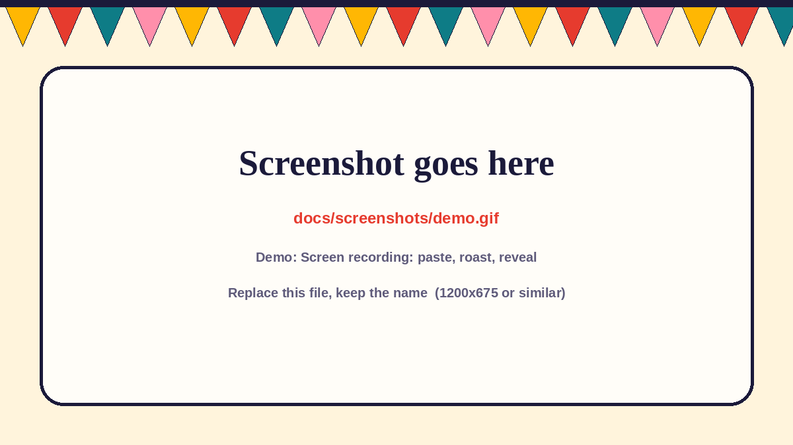
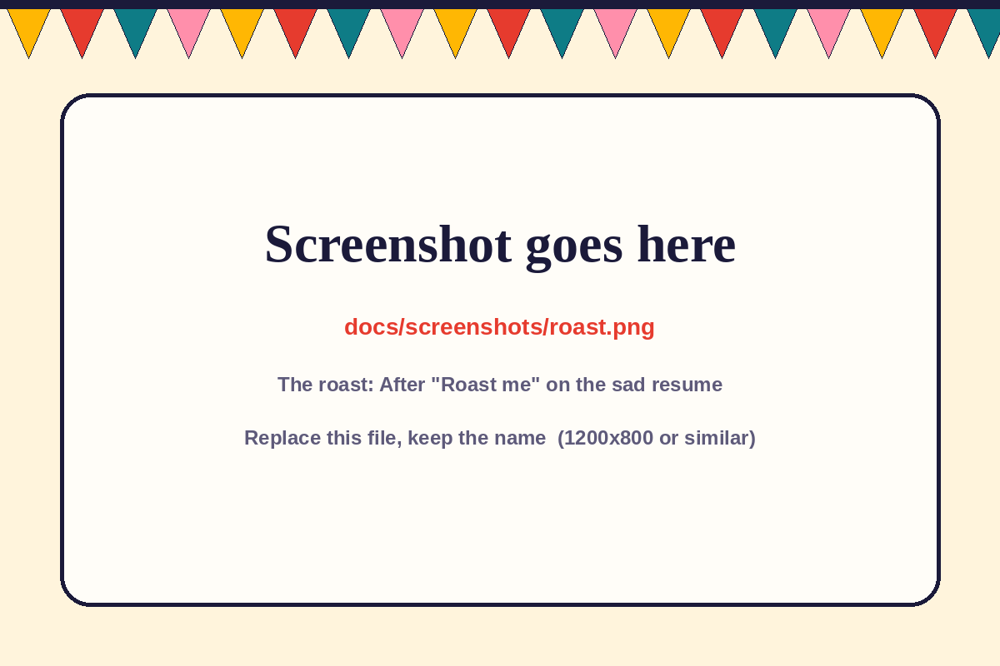
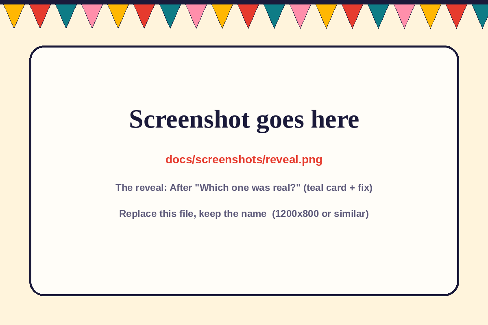
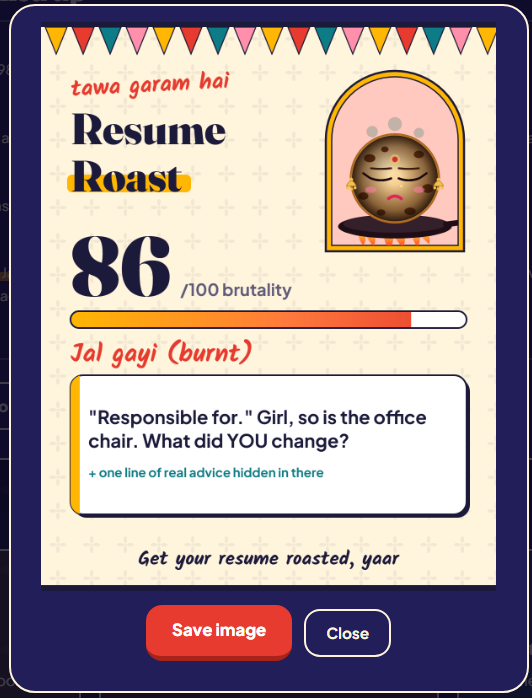
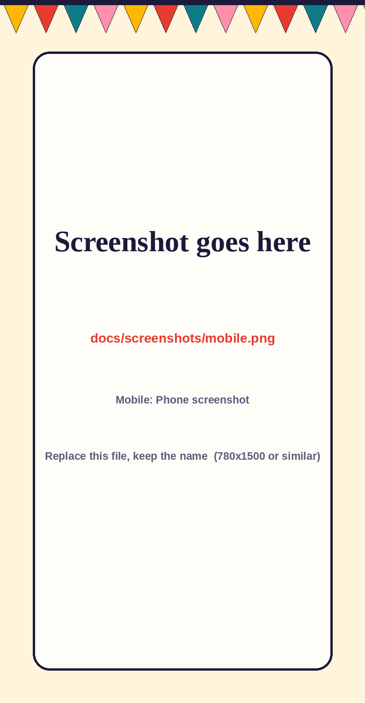

<h1 align="center">Resume Roast</h1>

<p align="center"><b>Paste your resume. Get roasted. One line of the roast is real advice. Find it.</b></p>

<p align="center">
  
  
  
</p>

<p align="center">
  
</p>
<p align="center">
  https://resume-roaster-alpha-ten.vercel.app/
  </p>
<p align="center">
  
</p>

---

## Why this exists

Placement season turns everyone into a resume editor. This tool roasts your resume the way roti gets roasted on a hot tawa: with heat, and with care. It roasts the document (clichés, weak verbs, missing numbers, padding), never the person, and buries one genuinely useful piece of advice inside the jokes. The mascot, a baddie roti with winged liner, a bindi and swinging jhumkas, sits on a hot tawa and gets progressively more charred as the score climbs.

## What it does

<table>
  <tr>
    <td width="50%" valign="top">
      
      <br><b>The roast</b><br>
      A brutality meter, a verdict, and 5 or 6 roast lines that quote your own words back at you. Three voices: <b>Bestie</b> (warm and hyped), <b>Baddie</b> (sharp and unbothered) and <b>Aunty ji</b> (loving and scandalised).
    </td>
    <td width="50%" valign="top">
      
      <br><b>Find the real advice</b><br>
      One roast line is genuine feedback in disguise. Press "Which one was real?" to reveal it, with a concrete fix and a rewritten example.
    </td>
  </tr>
  <tr>
    <td width="50%" valign="top">
      
      <br><b>Share card</b><br>
      A 1080x1350 PNG of your result for WhatsApp or Instagram.
    </td>
    <td width="50%" valign="top">
      
      <br><b>Built for phones too</b><br>
      Single column, no horizontal scroll, light and dark themes, reduced-motion friendly.
    </td>
  </tr>
</table>

Also on the page: a **roast wall** of sample roasts, and an **FAQ**. Plus a **marked-up resume** (every quoted line highlighted and numbered) and a **see exactly what gets sent** panel.

## The vibe

A bright, festive modern-desi poster, deliberately not dark and glossy: cream paper with a block-print booti pattern, indigo ink, haldi yellow, chilli red and peacock teal. A marquee and a toran (pennant bunting) sit across the top, the hero mascot stands inside a jharokha-style arch with floating roast bubbles, and the page is a full landing page: hero, paste + pick-your-roaster, how it works, a roast wall of sample roasts, and an FAQ. Headlines use Fraunces, handwritten accents use Kalam, body text uses Plus Jakarta Sans, and the copy talks like a sassy desi bestie. On wide screens the margins are filled with original illustrated desi snacks and festive bits (samosa, jalebi, diya, marigold, kite, kulhad chai, golgappa, bangles). Hover one and it spins, some clockwise and some counter-clockwise, then eases to a stop; click for an extra kick. They hide on narrower screens so they never cover content, and they stay still if the visitor prefers reduced motion. Dark mode swaps to a deep indigo night with the same colours.

## How it works

```text
browser                                   Vercel                         Anthropic
-------                                   ------                         ---------
paste resume
 -> mask email/phone/links/ID/name
 -> POST /api/roast  ------------------>  api/roast.js
                                           - validate length, rate-limit
                                           - add system prompt + tone
                                           - call Messages API  ------->  Claude (Haiku-class)
                                           - parse + sanitise JSON  <-----
 <- JSON {score, verdict, items, fix} <---
render roast, mascot reacts, share card

if the call fails (no key, 429, timeout, bad JSON)
 -> the built-in rule-based roaster runs in the browser instead
```

- **One LLM call per roast.** The model returns structured JSON: a brutality `score`, a `verdict`, 5 or 6 `items` (each with a verbatim `quote` and a `roast`), exactly one `real` item, a `real_fix` and an optional `rewrite`.
- **The server does not trust the model.** Invented quotes are dropped (a quote must appear in the resume), the score is clamped, exactly one item is marked real, and the browser escapes everything it renders.
- **The resume is treated as data, not instructions.** It is wrapped in `<resume>` tags, any closing tag inside it is stripped, and the system prompt says to ignore instructions found inside it.
- **Honest labelling.** Every result shows whether it came from the AI or the backup roaster.

### The backup roaster

When the AI is unavailable the browser runs 16 pattern rules instead, with the same output shape and the same three tones. It is not an LLM and it says so on the result.

| Rule | Catches | Points |
| --- | --- | --- |
| `nometric` | Bullets with no numbers at all | +18 |
| `weak` | "Responsible for", "worked on", "involved in", "participated in" | +12 |
| `buzz` | "Hardworking team player" style adjectives (3 or more) | +12 |
| `personal` | Date of birth, marital status, hobbies, declaration | +12 |
| `tutorial` | Tutorial clones: to-do list, weather app, Netflix clone, calculator | +10 |
| `skills` | A skills line with 14+ items | +10 |
| `obj` | A "career objective" or "seeking a challenging position" line | +10 |
| `nolink` | No GitHub, portfolio or any link | +8 |
| `certs` | 6 or more certificate/course lines | +8 |
| `long` | Over 700 words | +8 |
| `short` | Under 90 words | +10 |
| `edu` | Education placed above projects/experience | +6 |
| `email` | Gamer-tag style email address | +6 |
| `ms` | "MS Office" listed as a skill | +6 |
| `refs` | "References available on request" | +6 |
| `pron` | Three or more lines starting with "I" or "My" | +5 |

Score = 8 + (points x 0.72), minus bonuses for numbers in most bullets and for strong verbs, clamped to 0 to 100. Bands: under 25 lightly toasted, 25 to 49 medium rare, 50 to 74 well done, 75 and up burnt to a crisp.

## Privacy

- Before anything is sent, the browser masks emails, phone numbers, links, 12-digit ID numbers and the name line (the first short line). Open "See exactly what gets sent" to check.
- This site does not store resumes or log them. The text goes to the AI provider only to write the roast, under that provider's own data policy.
- Masking is best-effort pattern matching. Do not paste anything you would not be comfortable sending to an AI service.

## Deploy on Vercel

1. Push this repo to GitHub.
2. In Vercel: **Add New > Project**, import the repo, leave build settings empty.
3. Under **Environment Variables**, add `ANTHROPIC_API_KEY` with your key. Optionally add `ROAST_MODEL` (default is a small Haiku-class model).
4. Deploy. If you add or change a variable later, **redeploy** so the function sees it.
5. Open the site and roast something. The result chip should say **AI roast (Claude)**. If it says **Backup roaster**, the key is missing or the call failed.

**Protect your wallet.** A public page that calls an LLM can run up a bill if it goes viral.
- Set a hard monthly spend limit in the Anthropic Console's billing and limits settings.
- The function already caps input at 6,000 characters and allows about 8 roasts per visitor per 10 minutes. That limit is held in memory per serverless instance, so it is best-effort, not a guarantee. Treat the spend limit as the real protection.
- Never put the key in `index.html` or commit `.env` files. `.gitignore` already excludes them.

## Run it locally

```bash
git clone <this repo's URL>
cd resume-roast
npm test                     # 18 checks on the serverless function, with a mocked API

# backup roaster only (no key needed): just open the file
open index.html

# full stack with the AI call
cp .env.example .env.local   # then put your key in it
npx vercel dev
```

## Project structure

```text
resume-roast/
├── index.html               the whole front end (HTML, CSS, JS, SVG mascot)
├── api/roast.js             Vercel serverless function that calls the LLM
├── tests/roast.test.js      checks for the function (mocked API, no key needed)
├── docs/screenshots/        images used by this README
├── .env.example             environment variables
├── package.json
├── LICENSE
└── README.md
```

## Ideas for later

Not promises, just things worth trying: a "roast my LinkedIn About" mode, side-by-side before/after rewrites, a leaderboard of the most roasted bullet points (anonymous), and a Hindi/Hinglish roast option.

## Built with

Vanilla HTML, CSS and JavaScript, an inline-SVG roti mascot, the Canvas API for the share card, and a single Vercel serverless function. Vibe-coded with Claude, then tested in a headless browser.

## License

MIT (see [`LICENSE`](LICENSE)). The roti mascot is original artwork drawn in SVG for this project. Fonts (Fraunces, Kalam, Plus Jakarta Sans) load from Google Fonts under the SIL Open Font License.

---

<p align="center">Built by <b>Tharini</b></p>
